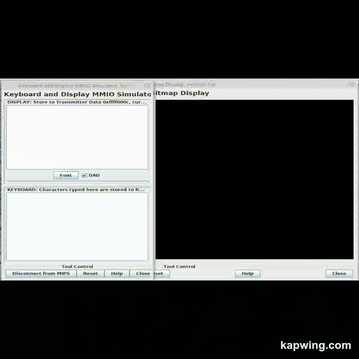

# Snake-MIPS

This is my Snake project in MIPS Assembly. 
A simple game to play while you're waiting for something! Move the snake around with the wasd keys, eat the orange dots to grow bigger, and avoid hitting your own tail.

## Demo:

## Built with:

* [Mars MIPS](http://courses.missouristate.edu/kenvollmar/mars/)

## Project

  
## Prerequisites

* You should install [Mars](http://courses.missouristate.edu/kenvollmar/mars/) MIPS Simulator.
* This program requires the Keyboard and Display MMIO and the Bitmap Display to be connected to MIPS.

## Components

### Preview

### Display Settings

### Sound Tune

## Author

* **Alessandro Farè**
