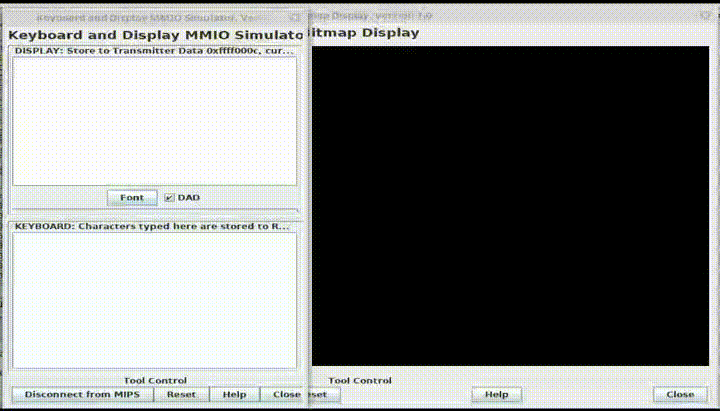
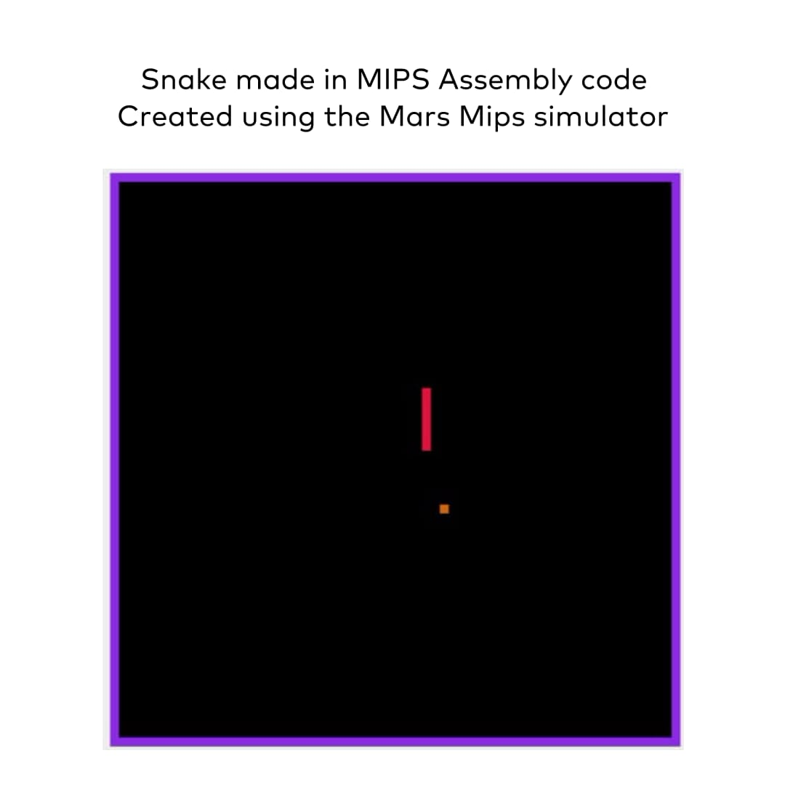
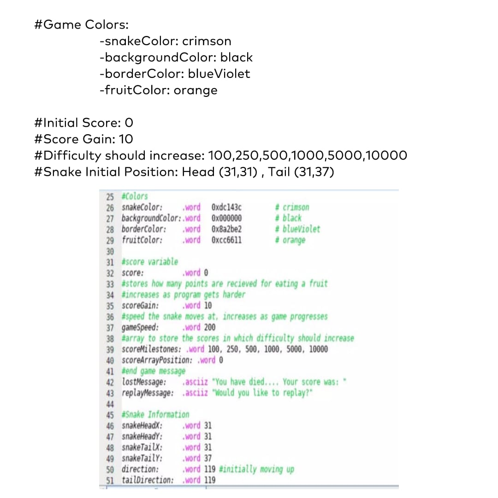
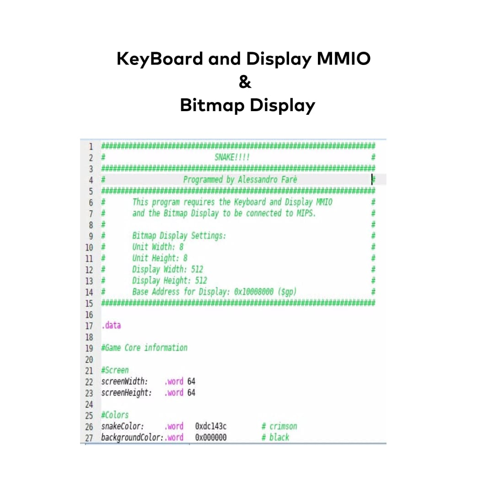
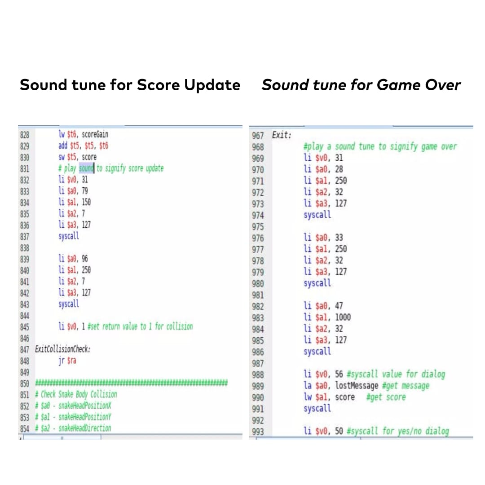

# Snake-MIPS

This is my Snake project in MIPS Assembly.\
A simple game to play while you're waiting for something! Move the snake around with the wasd keys, eat the orange dots to grow bigger, and avoid hitting your own tail.

## Demo:

  

## Built with:

* [Mars MIPS](http://courses.missouristate.edu/kenvollmar/mars/)

## Project

  
 

 
## Prerequisites

* You should install [Mars](http://courses.missouristate.edu/kenvollmar/mars/) MIPS Simulator.
* This program requires the Keyboard and Display MMIO and the Bitmap Display to be connected to MIPS.

## Components

### Preview

  

### Display Settings

  

### Sound Tune

  

## Author

* **Alessandro Farè**
